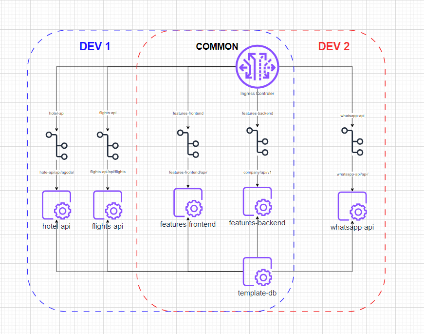
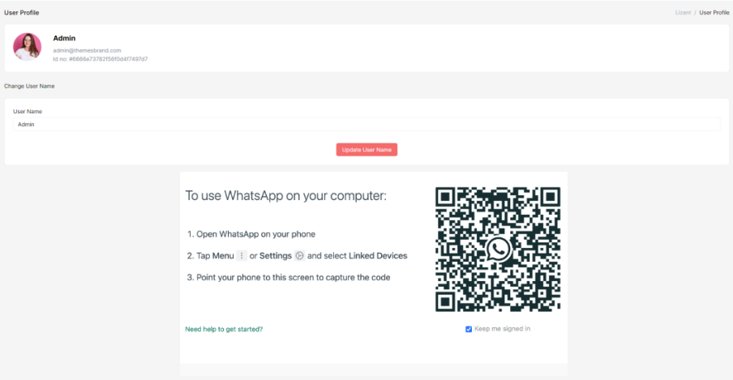
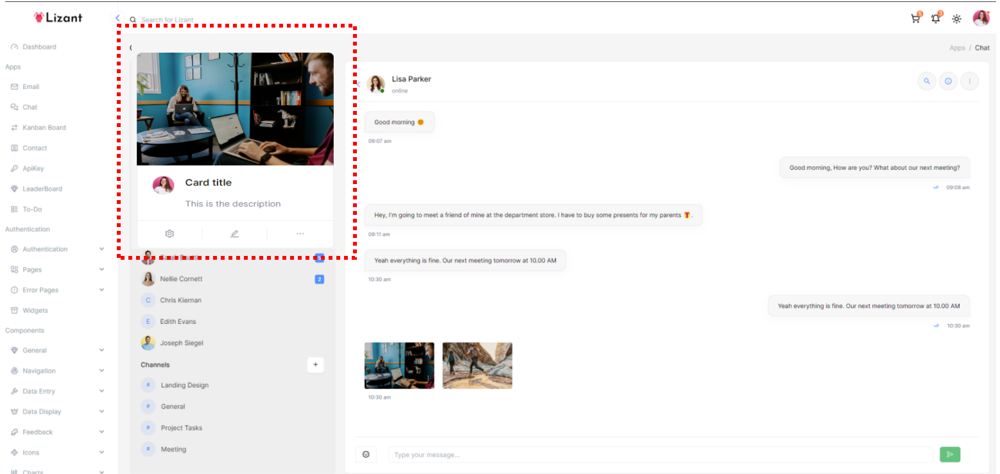

# To get started

- If you haven't already done so - reach to me on Discord: 
- Clone the relevant repositories:

 ```
mkdir project-master
cd project-master
git clone https://github.com/Safari-Expert/features-frontend.git
git clone https://github.com/Safari-Expert/features-backend.git
git clone https://github.com/Safari-Expert/whatsapp-api.git
```

<span style="color: red;">Any work that is being done must be coded on a new branch and merged later after review. </span>

### Stack
- **Backend** - Golang (Fiber + GORM)
- **Frontend** - ReactJS
- **Architecture** - K8 + NGINX / Traefik
- **Database** - PostgreSQL

# Project Objective

The main task is to implement a a chat-ui page and integrate a Wuzapi-API as a chat API service into wider project and the LizAnt UI React template provided. This is an integration project. You are not expected to make changes to whatsapp-api repo beyong deployment and configurations. There are other people working on this project who can assist with various tasks. Your work needs to be in scope - Implement the chat API and frontend functionality. 

### Deliverables:

- **Fulfil the main deliverable:** Integrate Wuzapi API into the Chat UI page as an independent service routed through ingress
- A docker-compose framework to deploy each component
- Update features-backend repository with configurations as needed
- Update features-frontend repository with your any enhancements to frontend and configs
- Update whatsapp-api repository (fork of [@asternic/wuzapi](https://github.com/asternic/wuzapi) with the necesary configuraitons
- Configure endpoints and link the LizAnt cat UI template to comms-api thrugh ingress. 
- PostgreSQL database configuration for chat related data shared between users.


## Architecture Description

The application architecture is designed to be modular and scalable, leveraging microservices and containerization. Here is a detailed description of each component:

**You are sharing the repos** 
features-frontend and features-backend with another developer.
- <span style="color: red;">Dev 2 is repsonsible for whatsapp-api integration. </span>
- <span style="color: blue;">Dev 1 is repsonsible for other integrations </span>



1. **features-frontend**:
    - We are using the LizAnt react template - https://ur0.jp/i23Kz
    - This template is already provided for you ready to use and integrated with features-backend for authorisation
    - There are rules on how to update this repository please see README.md inside the features-frontend repo.
    - **Uses features-frontend/api/ endpoint**

2. **features-backend**:
    - Used to manage user sessions, authentication
    - There are rules on how to update this repository please see README.md inside the features-backend repo.
    - **Uses company/api/v1/ endpoint**
  
3. **whatsapp-api**:
    - You are inside this repo now! 
    - Manages chat functionality, including message storage, retrieval, and real-time updates.
    - Integrates with the existing Go backend for user authentication.
    - [@asternic/wuzapi](https://github.com/asternic/wuzapi)
    - WuzAPI - an implementation of [@tulir/whatsmeow](https://github.com/tulir/whatsmeow) library as a simple RESTful API service with multiple device support and concurrent sessions.
    - **Uses whatsapp-api/api/ endpoint**

5. **template-db (PostgreSQL)**:
    - Stores user data, chat messages, and other related information.
    - **A MySQL file with sample schema and dummy data is present in the db folder under main**
  
6. **Controller**:
    - Manages and routes requests to the appropriate services. you can use nginx for dev but traefik is the final solution. 
    - https://hub.docker.com/_/traefik

7. **Docker**:
    - we are using docker-compose for all dev. upon delivery all 3 repos you are working in must be up and running and deployable


## Chat Scenarios / Functionality

There is an organization with multiple users using the React web-app. You can assume all users are admins. 

1. **Register WhatsApp web** - The user must log in and receive a QR code to register WhatsApp web. Users authenticated in main-backend. There are multiple users each with unique whatsapp. 
2. **De-Register WhatsApp web** - The user must be able to de-register WhatsApp web.
3. **Cat Load and Contact Merge** - WhatsApp web API is called to retrieve all contacts and historical chats. There is a pre-existing contacts table available in MySQL. The engine must join the data sets by phone numbers and identify matches.
5. **Multiple Users** - Multiple users use the same WhatsApp backend and are able to use the chat functionality offered by WuzAPI.
6. **Decoupled Backends** - We have the main-backend in Go which powers use authentication only.  The WhatsApp API (comms-api) should be implemented as an independent service with own endpoint.
7. **Postgres DB** - By default, WuzAPI is configured to use SQLite, but this implementation of [@tulir/whatsmeow](https://github.com/tulir/whatsmeow) library also supports PostgreSQL. A separate container running PostgreSQL must be deployed to support any CRUD operations from WuzAPI.
8. **User Chat View** - Other users in the organisations can't see others conversations BUT a user can give read-only access to another user to one of his own chats. 


## Chat Frontend Modifications
- Modify the chat box for better screen fit.
- Add a favorites section to pin contacts.
- Enhance the contact card to integrate user-specific information and tags from the database (we need to display a database 'Tag' and basic contact info on left pane. see screenshot below with dashed line in red. 
- **Admin Screen:** There is a Profile page already available. YAdd section where user can request a QR code and register their WhatsApp.



- **Chat App:** Develop a chat application for users to communicate. Ensure it can handle 3-4 concurrent users.



 
## MySQL Schema Credentials with Data Example

You can check some dummy data and data model using the credentials here but everything will be migrated to PostgreSQL. 

```
User: `xxxxxxxx`
Password: `xxxxxxxx`
Host: `xxxxxxxx`
Schema: `xxxxxx`
```

## Notes on the Data

1. You can deploy a copy of the database locally by running `db/db_dump_file.sql`.
2. Once the cat app is connected via QR code, it should automatically pull in and populate the `contact_whatsapp` table with all available contacts from WhatsApp.
3. The table `tag_ref` includes available tags which should be fed into the contact card - see Enhance the contact requirements in the frontend section.
4. There is a `tag_id` field in `contact_ref` which should be displayed on the contact card in the chat app.
5. All chat data should be stored.
6. There are 3 available users in `user_ref` and they provide the login credential information for the web app.
7. Be able to add a contact from the chat app via the + button; this should populate `contact_ref`.

